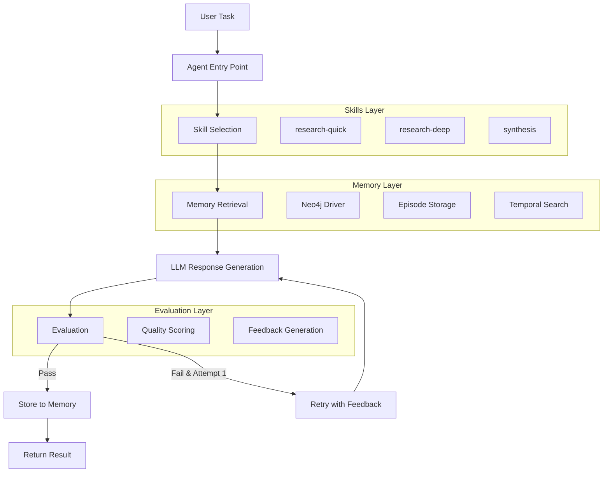

# Implementation Plan: Context Layer Agent Demo

## Objective

Build a TypeScript research assistant agent demonstrating three architectural layers:
- **Skills Layer**: Dynamic routing to domain-specific research skills
- **Memory Layer**: Temporal knowledge graph for persistent context
- **Evaluation Layer**: Runtime quality gate with retry logic

## Critical Finding: Graphiti Package Availability

**Issue**: The original spec references `graphiti-client` (npm package), but:
- `graphiti-core` is **Python-only** (PyPI package)
- No official TypeScript/Node.js client exists
- User's reference project (`context-layer-part2b`) uses Python `graphiti-core[falkordb]`

**Resolution Strategy**: Use **neo4j-driver** directly and implement a simplified temporal memory layer without Graphiti. This approach:
- Maintains compatibility with Neo4j (user has Neo4j running locally)
- Implements core temporal memory concepts (episode storage, temporal search)
- Stays within TypeScript ecosystem
- Provides graceful degradation if Neo4j is unavailable

---

## Architecture Overview



---

## Project Structure

```
context-layer-agent/
├── src/
│   ├── agent.ts                      # Main agent orchestration
│   ├── index.ts                      # CLI entry point
│   ├── skills/
│   │   ├── loader.ts                 # Skill selection logic
│   │   └── definitions/
│   │       ├── research-quick.ts     # Quick summary skill
│   │       ├── research-deep.ts      # Deep analysis skill
│   │       └── synthesis.ts          # Multi-session synthesis skill
│   ├── memory/
│   │   └── client.ts                 # Neo4j-based temporal memory
│   └── evaluation/
│       └── evaluator.ts              # Quality evaluation logic
├── .context/
│   └── PROJECT.md                    # Agent behavior rules
├── .env.example                      # Environment template
├── package.json                      # Dependencies
└── tsconfig.json                     # TypeScript config
```

---

## Implementation Steps

### **Step 1: Project Scaffolding**

**Targets**: `package.json`, `tsconfig.json`, `.env.example`, `.context/PROJECT.md`

**Actions**:
1. Initialize `package.json` with dependencies:
   ```json
   {
     "dependencies": {
       "@anthropic-ai/sdk": "^0.34.0",
       "neo4j-driver": "^5.28.0",
       "zod": "^3.24.1"
     },
     "devDependencies": {
       "typescript": "^5.7.2",
       "ts-node": "^10.9.2",
       "@types/node": "^22.10.5"
     }
   }
   ```

2. Create `tsconfig.json` with:
   - `target`: ES2020
   - `module`: commonjs
   - `strict`: true
   - `esModuleInterop`: true
   - `outDir`: ./dist
   - `rootDir`: ./src

3. Create `.env.example`:
   ```
   ANTHROPIC_API_KEY=your_key_here
   NEO4J_URI=bolt://localhost:7687
   NEO4J_USER=neo4j
   NEO4J_PASSWORD=password
   ```

4. Create `.context/PROJECT.md` with agent behavior rules (content from spec)

**Verification**:
- ✅ `npm install` completes without errors
- ✅ `npx tsc --noEmit` shows zero errors

---

### **Step 2: Memory Layer Implementation**

**Target**: `src/memory/client.ts`

**Actions**:

1. **Import neo4j-driver**:
   ```typescript
   import neo4j, { Driver, Session } from 'neo4j-driver';
   ```

2. **Initialize Neo4j driver** with environment variables and connection pooling:
   ```typescript
   const driver: Driver = neo4j.driver(
     process.env.NEO4J_URI ?? 'bolt://localhost:7687',
     neo4j.auth.basic(
       process.env.NEO4J_USER ?? 'neo4j',
       process.env.NEO4J_PASSWORD ?? 'password'
     )
   );
   ```

3. **Implement `storeResearchMemory()`**:
   - Create episode node with properties: `topic`, `content`, `quality`, `timestamp`
   - Use Cypher: `CREATE (e:Episode {topic: $topic, content: $content, quality: $quality, createdAt: datetime()})`
   - Handle connection errors gracefully (log warning, don't crash)

4. **Implement `retrieveRelevantMemory()`**:
   - Query episodes by topic similarity using full-text search or CONTAINS
   - Cypher: `MATCH (e:Episode) WHERE e.topic CONTAINS $topic OR e.content CONTAINS $topic RETURN e ORDER BY e.createdAt DESC LIMIT 5`
   - Format results as: `[timestamp] content snippet` (one per line)
   - Return `'No prior research found on this topic.'` if empty

5. **Error handling**:
   - Wrap all Neo4j operations in try/catch
   - Log connection errors: `console.warn('⚠️  Memory unavailable (Neo4j not connected). Continuing without memory.')`
   - Return empty results on failure (don't throw)

**Verification**:
- ✅ Compiles without TypeScript errors
- ✅ Gracefully handles Neo4j unavailability (doesn't crash)
- ✅ If Neo4j is running: successfully stores and retrieves episodes

---

### **Step 3: Skills Layer — Skill Definitions**

**Targets**: `src/skills/definitions/research-quick.ts`, `research-deep.ts`, `synthesis.ts`

**Actions**:

1. **Define Skill interface**:
   ```typescript
   export interface Skill {
     name: string;
     description: string;
     systemContent: string;
   }
   ```

2. **`research-quick.ts`**:
   - name: `"research-quick"`
   - description: Triggers on "quick summary", "what is", "brief overview", "current status of"
   - systemContent: Rules for 150-300 words, 2-3 paragraphs, no headers, prioritize recency, state uncertainty, end with what deeper research would add

3. **`research-deep.ts`**:
   - name: `"research-deep"`
   - description: Triggers on "deep dive", "analyze", "compare", "explain in detail", "I need to understand", "architecture of"
   - systemContent: Rules for 600-1000 words, use headers, structure: Context → Analysis → Implications → Unknowns, epistemic markers on major claims

4. **`synthesis.ts`**:
   - name: `"synthesis"`
   - description: Triggers on "summarize multiple", "combine these", "what's the pattern across", "synthesize"
   - systemContent: Rules for 300-500 words, start with pattern, then evidence, then gaps, reference prior sessions explicitly

**Verification**:
- ✅ All files export a const with type `Skill`
- ✅ Descriptions clearly distinguish skill purposes

---

### **Step 4: Skills Layer — Selection Logic**

**Target**: `src/skills/loader.ts`

**Actions**:

1. **Import all skill definitions** and Anthropic SDK

2. **Implement `selectSkill(task: string)`**:
   - Build `skillMenu` string listing each skill's name + description
   - Call Anthropic `claude-opus-4-6` with:
     - System prompt: "You are a skill router. Return ONLY the skill name that best matches the task."
     - User message: `Task: ${task}\n\nAvailable skills:\n${skillMenu}\n\nReturn only the skill name.`
     - `max_tokens: 100`
   - Parse response text using type guard:
     ```typescript
     const responseText = (response.content[0] as { type: 'text'; text: string }).text.trim();
     ```
   - Find matching skill by name
   - Fallback: return `researchQuickSkill` if no match

3. **Error handling**:
   - If ANTHROPIC_API_KEY is missing, log warning and return `researchQuickSkill`

**Verification**:
- ✅ Returns correct skill for various task types
- ✅ Handles API errors gracefully
- ✅ Fallback works when skill name is unrecognized

---

### **Step 5: Evaluation Layer**

**Target**: `src/evaluation/evaluator.ts`

**Actions**:

1. **Define `EvaluationResult` interface**:
   ```typescript
   export interface EvaluationResult {
     score: number;      // 0.0 to 1.0
     passed: boolean;    // score >= 0.7
     feedback: string;
     flags: string[];
   }
   ```

2. **Implement `evaluateResponse(task, skill, response, memoryContext)`**:
   - Call Anthropic `claude-opus-4-6` with `max_tokens: 300`
   - Evaluation prompt with criteria:
     1. Answers the actual task (0-0.4)
     2. Uses appropriate depth for skill type (0-0.3)
     3. Claims have appropriate certainty markers (0-0.2)
     4. Integrates or acknowledges prior context when provided (0-0.1)
   - Request JSON output: `{ "score": 0.85, "feedback": "...", "flags": ["..."] }`
   - Parse JSON response
   - Set `passed = score >= 0.7`
   - Return `EvaluationResult`

3. **Error handling**:
   - If API fails or JSON parsing fails, return default:
     ```typescript
     { score: 0.5, passed: false, feedback: 'Evaluation failed', flags: ['error'] }
     ```

**Verification**:
- ✅ Returns valid `EvaluationResult` with score, passed, feedback, flags
- ✅ Pass threshold (0.7) correctly applied
- ✅ Handles malformed JSON gracefully

---

### **Step 6: Agent Orchestration**

**Target**: `src/agent.ts`

**Actions**:

1. **Import all layers**: skills, memory, evaluation, Anthropic SDK, fs (for PROJECT.md)

2. **Implement `runAgent(task: string): Promise<string>`** with this exact flow:

   ```
   1. Log: 🔵 Task: ${task}
   
   2. Skill Selection:
      - Log: ⚙️  Selecting skill...
      - Call selectSkill(task)
      - Log: ✅ Skill: ${skill.name}
   
   3. Memory Retrieval:
      - Log: 🧠 Retrieving memory...
      - Call retrieveRelevantMemory(task)
      - Log: First 80 chars of memory context
   
   4. System Prompt Composition:
      - Read .context/PROJECT.md using fs.readFileSync
      - Combine: projectContext + active skill name + skill.systemContent + memoryContext
   
   5. Response Generation Loop (max 2 attempts):
      For attempt 1 and 2:
        - Log: 📝 Generating response (attempt ${attempt})...
        - Call Anthropic claude-opus-4-6 with system prompt + user task
          (max_tokens: 1500)
        - Log: 🔍 Evaluating...
        - Call evaluateResponse(task, skill.name, response, memoryContext)
        - Log: 📊 Score: ${score} | Passed: ${passed}
        - If passed: break loop
        - If attempt 1 failed: append evaluator feedback to task for retry
   
   6. Memory Storage:
      - Log: 💾 Storing to memory...
      - Call storeResearchMemory(task, response, evalResult.score)
   
   7. Return final response
   ```

3. **Color emoji prefixes** (CRITICAL for demo video):
   - Must match exactly: 🔵 ⚙️ ✅ 🧠 📝 🔍 📊 💾

4. **Error handling**:
   - Catch all errors, log them, and return error message
   - Ensure memory errors don't crash the agent

**Verification**:
- ✅ Logs appear in correct order with exact emoji prefixes
- ✅ Retry logic works (attempt 2 includes feedback)
- ✅ Memory stores response even if evaluation failed
- ✅ Agent doesn't crash if memory is unavailable

---

### **Step 7: CLI Entry Point**

**Target**: `src/index.ts`

**Actions**:

1. **Parse command-line arguments**:
   ```typescript
   const task = process.argv.slice(2).join(' ');
   ```

2. **Validate input**:
   ```typescript
   if (!task) {
     console.error('Usage: npx ts-node src/index.ts "your research task"');
     process.exit(1);
   }
   ```

3. **Execute agent**:
   ```typescript
   runAgent(task)
     .then(result => {
       console.log('\n📋 RESULT:\n');
       console.log(result);
     })
     .catch(err => {
       console.error('Agent error:', err);
       process.exit(1);
     });
   ```

**Verification**:
- ✅ `npx ts-node src/index.ts "test task"` executes without errors
- ✅ Error message shown when no task provided

---

### **Step 8: Environment Setup Documentation**

**Target**: Add README section (inline, no separate file unless user requests)

**Actions**:

1. Add npm script to `package.json`:
   ```json
   "scripts": {
     "start": "ts-node src/index.ts"
   }
   ```

2. Inline instructions (no README.md file):
   - Copy `.env.example` to `.env`
   - Add `ANTHROPIC_API_KEY`
   - Optionally configure Neo4j credentials (defaults work for local Neo4j)

**Verification**:
- ✅ `npm start "What is GPT-5.4?"` works after env setup

---

### **Step 9: End-to-End Testing**

**Demo Commands** (from spec):

1. **First run (no memory)**:
   ```bash
   npx ts-node src/index.ts "What is GPT-5.4's computer use capability?"
   ```
   - Expected: Skill selection, no memory found, response generated, evaluated, stored

2. **Second run (memory exists)**:
   ```bash
   npx ts-node src/index.ts "How does GPT-5.4's computer use compare architecturally to Claude's approach?"
   ```
   - Expected: Skill selection, **memory retrieved from first run**, synthesis skill triggered, response generated, evaluated, stored

**Verification Checklist**:
- ✅ All colored log prefixes appear exactly as specified
- ✅ Memory retrieval log shows content from first run in second run
- ✅ Evaluation scores displayed
- ✅ Retry logic visible if first attempt fails evaluation
- ✅ Agent completes both runs without crashes

---

## Definition of Done

| Step | Target Files | Success Criteria |
|------|-------------|------------------|
| 1 | package.json, tsconfig.json, .env.example, .context/PROJECT.md | `npm install` + `npx tsc --noEmit` succeed |
| 2 | src/memory/client.ts | Compiles, handles Neo4j unavailability, stores/retrieves episodes |
| 3 | src/skills/definitions/*.ts | All export valid `Skill` objects |
| 4 | src/skills/loader.ts | Returns correct skill, handles errors, has fallback |
| 5 | src/evaluation/evaluator.ts | Returns `EvaluationResult`, applies 0.7 threshold, handles JSON errors |
| 6 | src/agent.ts | Logs with exact emoji prefixes, retry works, memory errors don't crash |
| 7 | src/index.ts | CLI parsing works, error messages clear |
| 8 | package.json | npm script added |
| 9 | Full system | Both demo commands execute successfully, memory visible in run 2 |

---

## Risks & Mitigations

| Risk | Impact | Mitigation |
|------|--------|-----------|
| Neo4j not running | Memory unavailable | Graceful degradation: log warning, continue without memory |
| Anthropic API rate limits | Agent fails during demo | Use conservative max_tokens (100-1500), handle 429 errors |
| Evaluation always fails | Infinite retry loop | Hard limit: max 2 attempts total |
| TypeScript type errors | Compilation fails | Use explicit type guards for Anthropic SDK responses |
| Missing ANTHROPIC_API_KEY | Agent crashes | Check at startup, provide clear error message |

---

## Dependencies

- `@anthropic-ai/sdk` (^0.34.0) — Claude API
- `neo4j-driver` (^5.28.0) — Neo4j connectivity
- `zod` (^3.24.1) — Runtime validation
- `typescript` (^5.7.2) — Type safety
- `ts-node` (^10.9.2) — Direct TS execution

---

## Notes for Implementation

1. **Colored emoji prefixes are CRITICAL** — they appear on screen during video filming
2. **Memory storage happens regardless of evaluation pass/fail** — quality score stored either way
3. **No Graphiti dependency** — simplified temporal memory using Neo4j directly
4. **Graceful degradation** — agent continues if Neo4j unavailable
5. **Two-attempt limit** — prevents infinite retry loops
6. **All Anthropic calls use `claude-opus-4-6`** — model consistency
7. **Strict TypeScript** — no `any` types where avoidable, use type guards

---

## Traceability Matrix

| Step | Targets | Verification |
|------|---------|--------------|
| 1 | package.json, tsconfig.json, .env.example, PROJECT.md | `npm install` + `tsc --noEmit` |
| 2 | memory/client.ts | Compile + Neo4j test (graceful fail if unavailable) |
| 3 | skills/definitions/*.ts | All export `Skill` interface |
| 4 | skills/loader.ts | Skill selection + fallback test |
| 5 | evaluation/evaluator.ts | `EvaluationResult` return + threshold test |
| 6 | agent.ts | Log emoji prefixes + retry logic test |
| 7 | index.ts | CLI argument parsing test |
| 8 | package.json scripts | `npm start` test |
| 9 | Full system | Both demo commands succeed |